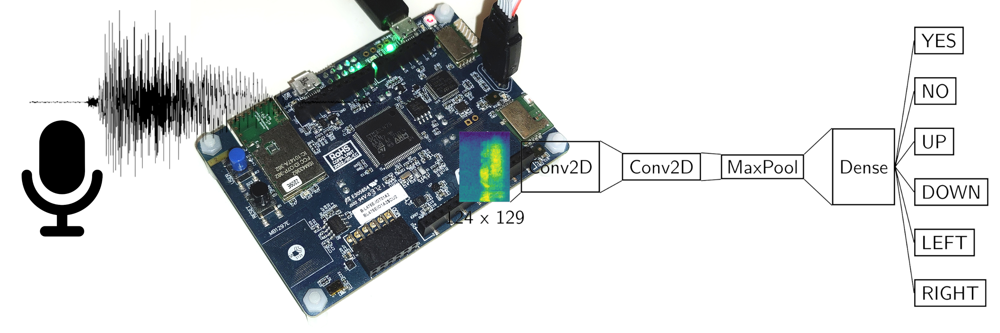

# Speech Recognition on STM32 using Machine Learning

This uses the [TensorFlow Lite for Microcontrollers](https://github.com/tensorflow/tflite-micro/)
framework to perform simple keyword recognition on an STM32L475VGT
B-L745E-IOT01A2 development board.
It can detect "yes", "no", "up", "down", "left" and "right". It is
trained on the [speech_commands](https://huggingface.co/datasets/google/speech_commands)
dataset by P. Warden.

[ML on MCU](https://www.vvz.ethz.ch/Vorlesungsverzeichnis/lerneinheit.view?semkez=2024S&ansicht=KATALOGDATEN&lerneinheitId=176625&lang=en) Demo Project

:warning: Make sure you clone the repository with `--recursive`, as it contains submodules.

## Progress
- [x] Model running on PC using Tensorflow and TFLite
- [x] Model running on STM32 using TFLite runtime
- [x] STFT preprocessing ported to STM32
- [ ] PDM Microphone readout on STM32

## How does it work?
The model running on the microcontroller is able to classify recordings
of spoken keywords into 6 classes: yes, no, up, down, left and right.
For this, a short-time fourier transform is applied
to the input waveform. This is achieved by taking a fixed-size window
of the signal, multiplying it by a Hanning window function and then
applying an FFT to the result. The output of the FFT results
in a single column of the spectrum.

Then, this 124 x 129 spectrogram is fed into a neural network,
which was previously trained using the TensorFlow framework.
The model consists of a simple convolutional and dense neural network,
and was quantized to only use integers to speed up to inference time on
the resource-constrained microcontroller.
After training, the model is converted to a TFlite model, which
can run on top of the TFLite runtime
on the STM32.

## Dependencies
You only need some essentials and the `arm-none-eabi` toolchain.
On Ubuntu 23.10 and similar this should be enough to build the project:

~~~
sudo apt-get update
sudo apt-get install build-essential cmake gcc-arm-none-eabi python3-numpy python3-pil unzip
~~~

Making it work on other Linux distros is possible, running it on Windows
requires major changes because a lot of Linux-specifics are hard-coded,
and is probably not worth the trouble.

## Model Training
Create a virtual environment and install the python dependencies

~~~
cd ml
python -m venv venv
source venv/bin/activate
pip install -r requirements.txt
~~~

The model can be trained by running `train.py`, which will also download the
dataset and split it into train, test and validation sets.
The model will only be trained if `model.keras` does not exist already,
so delete that to force retraining.

~~~
python train.py
~~~

Once the model is trained, it is automatically copied to `src/models`,
where it will be compiled into the firmware in the next
step.

## Build
With the model trained, you can proceed to build the code.

~~~
cd stm32-speech-recognition
cmake -B build && make -C build
~~~

## Upload
To upload the compiled binary (`demo.elf`) to the board, you can either use
[st-util](https://github.com/stlink-org/stlink), STM32CubeIDE,
or any other SWD programmer (e.g., SEGGER j-link with Ozone).

## Evaluation
Currently, there is no support for reading out the on-board microphone,
so a waveform needs to be sent from the computer.

To evaluate the performance of the model running on the microcontroller,
there are some helper scripts in `tools`. These scripts automatically
send waveforms from the test set to the STM32 over UART, convert and plot
various things. With the `-DPRINT_SPECTROGRAM` build flag spectrograms can be
obtained from the microcontroller. Please note that these scripts are somewhat
experimental, i.e., they might be adapted to work on your system.

Currently, the overall accuracy is about 80%.

