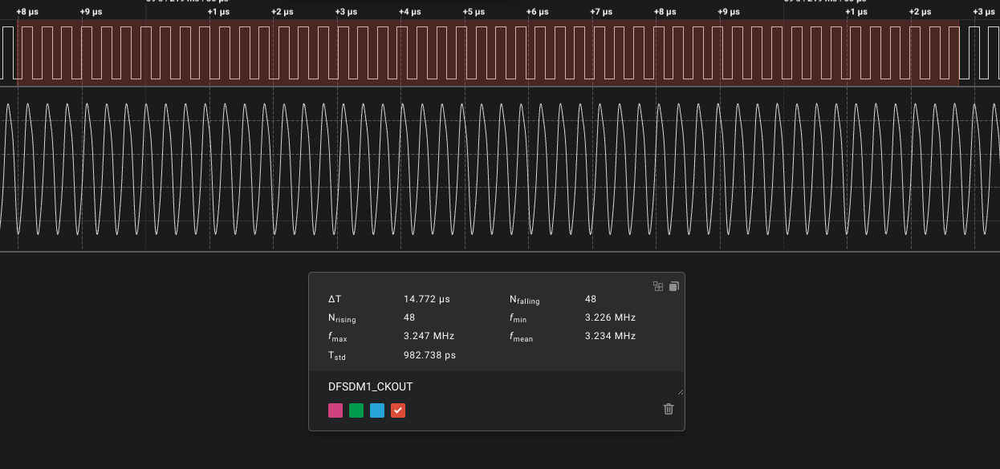
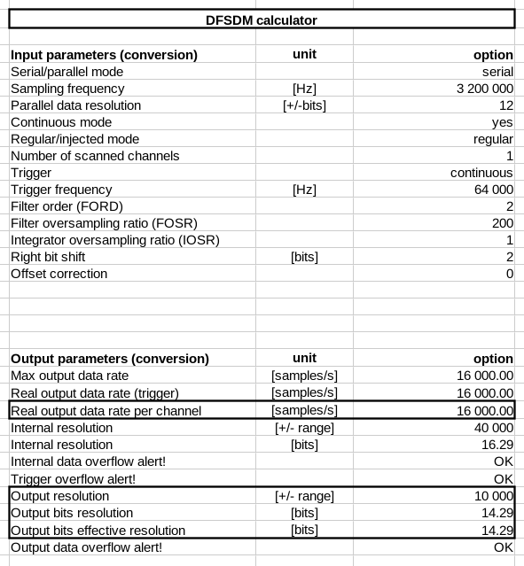

# Engineering Log
Notebook to write down thoughts and calculations during development.

## Microphone Acquisition
The on-board microphone (MP34DT01-M) requires an input clock of up to 3.25 MHz.
By setting the DFSDM clock divider to 25, this results in a 3.2 MHz output
clock (with 80 MHz system clock). Verification with logic analyzer shows
expected clock at around 3.2 MHz.

### Sampling rate
Using ST's [DFSDM calculator](https://www.st.com/content/ccc/resource/technical/document/technical_article/group0/1b/40/1d/43/1b/8d/47/65/dfsdm_tutorial/files/dfsdm_tutorial.xlsx/jcr:content/translations/en.dfsdm_tutorial.xlsx), we set the filter
parameters to achieve a final sampling rate of 16 kHz.

